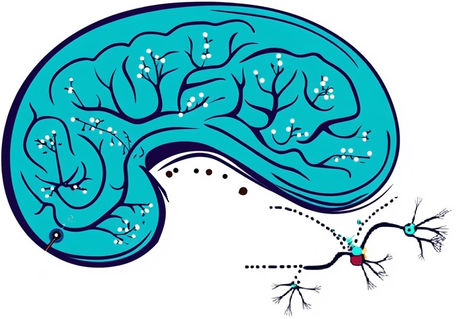
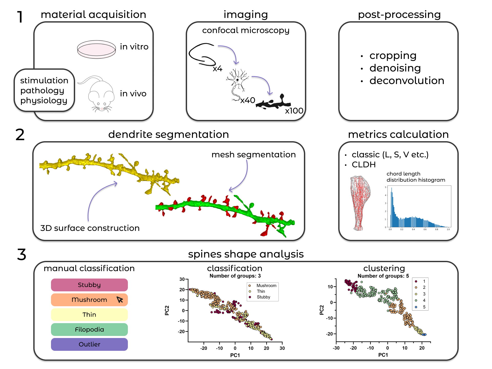

[](https://github.com/Biomed-imaging-lab/SpineTool/blob/main/LICENSE)
[]()
[]()
[]()
[](https://github.com/Biomed-imaging-lab/SpineTool/issues)


<br />
<div align="center">
  <a href="https://github.com/Biomed-imaging-lab/SpineTool">
    
  </a>

  <h2 align="center">SpineTool</h2>

  <p align="center">
    Dendritic spine analysis tool for dendritic spine image segmentation, dendritic spine morphologies extraction, analysis and clustering.
    <br />
    <a href="https://doi.org/10.1038/s41598-023-37406-4"><strong> Explore the research paper »</strong></a>
    <br />
    <br />
    <a href="#Citation">Cite</a>
    ·
    <a href="https://static-content.springer.com/esm/art%3A10.1038%2Fs41598-023-37406-4/MediaObjects/41598_2023_37406_MOESM1_ESM.pdf">Read Tutorial</a>
    ·
    <a href="mailto:daria.welt@bk.ru&subject=SpineTool_feedback">Connect</a>
  </p>

[](https://www.facebook.com/sharer/sharer.php?u=https://github.com/Biomed-imaging-lab/SpineTool)
[](https://www.linkedin.com/shareArticle?mini=true&url=https://github.com/Biomed-imaging-lab/SpineTool)
[](https://www.reddit.com/submit?title=Check%20out%20this%20project%20on%20GitHub:%20https://github.com/Biomed-imaging-lab/SpineTool)
[](https://t.me/share/url?url=https://github.com/Biomed-imaging-lab/SpineTool&text=Check%20out%20this%20project%20on%20GitHub)


</div>


[Ekaterina, P., Peter, V., Smirnova, D., Vyacheslav, C., Ilya, B. (2023). SpineTool is an open-source software for analysis of morphology of dendritic spines. Scientific Reports.13. 
10.1038/s41598-023-37406-4.](https://doi.org/10.1038/s41598-023-37406-4)

Dendritic spines form most excitatory synaptic inputs in neurons and these spines are altered in many neurodevelopmental 
and neurodegenerative disorders. Reliable methods to assess and quantify dendritic spines morphology are needed, but most 
existing methods are subjective and labor intensive. To solve this problem, we developed an open-source software that 
allows segmentation of dendritic spines from 3D images, extraction of their key morphological features, and their 
classification and clustering. Instead of commonly used spine descriptors based on numerical metrics we used chord 
length distribution histogram (CLDH) approach. CLDH method depends on distribution of lengths of chords randomly 
generated within dendritic spines volume. To achieve less biased analysis, we developed a classification procedure that 
uses machine-learning algorithm based on experts’ consensus and machine-guided clustering tool. These approaches to 
unbiased and automated measurements, classification and clustering of synaptic spines that we developed should provide 
a useful resource for a variety of neuroscience and neurodegenerative research applications.




## System requirements
- Windows 8 or newer
- Minimum 1GB RAM
- Minimum 6 GB disk space

## Install
1. Download code
2. Unzip [CGAL files](https://github.com/pv6/cgal-swig-bindings/releases/download/python-build/CGAL.zip) next to code, e.g. `PATH_TO_CODE\CGAL\...`
3. Install [Anaconda](https://www.anaconda.com/) (2022.10 v. or newer)
4. Open Anaconda
5. Execute
```cmd
cd PATH_TO_CODE
conda create --name spine-analysis -c conda-forge --file requirements.txt -y
```
## Run
1. Open Anaconda
2. Execute
```cmd
cd PATH_TO_CODE
conda activate spine-analysis
jupyter notebook
```

## Example data
### example dendrite
Dataset consist of a .tif image of a dendrite, 22 polygonal
meshes of dendrite spines and a dendrite polygonal mesh computed with `dendrite-segmentation.ipynb` notebook. This 
example dataset provides a demonstration of dendrite image segmentation performance and functionality of the 
methods from the `Utilities.ipynb` notebook.
### example dataset
Dataset consists of 270 polygonal meshes of dendrite spines related to 54 dendrites and of 54
polygonal   meshes   for   dendrites computed with `dendrite-segmentation.ipynb` notebook.  A dataset subdirectory 
named "manual_classification" contains the expert markups from 8 people obtained using the `spine-manual-classification.ipynb` 
and the results of merging the classifications to obtain a consensus classification. This  example dataset provides a 
demonstration of dendrite spines classification and clustering performance and functionality of the 
methods from the `Utilities.ipynb` notebook.

## Citation
```
TY  - JOUR
AU  - Pchitskaya, Ekaterina
AU  - Vasiliev, Peter
AU  - Smirnova, Daria
AU  - Chukanov, Vyacheslav
AU  - Bezprozvanny, Ilya
PY  - 2023
DA  - 2023/06/29
TI  - SpineTool is an open-source software for analysis of morphology of dendritic spines
JO  - Scientific Reports
SP  - 10561
VL  - 13
IS  - 1
AB  - Dendritic spines form most excitatory synaptic inputs in neurons and these spines are altered in many neurodevelopmental and neurodegenerative disorders. Reliable methods to assess and quantify dendritic spines morphology are needed, but most existing methods are subjective and labor intensive. To solve this problem, we developed an open-source software that allows segmentation of dendritic spines from 3D images, extraction of their key morphological features, and their classification and clustering. Instead of commonly used spine descriptors based on numerical metrics we used chord length distribution histogram (CLDH) approach. CLDH method depends on distribution of lengths of chords randomly generated within dendritic spines volume. To achieve less biased analysis, we developed a classification procedure that uses machine-learning algorithm based on experts’ consensus and machine-guided clustering tool. These approaches to unbiased and automated measurements, classification and clustering of synaptic spines that we developed should provide a useful resource for a variety of neuroscience and neurodegenerative research applications.
SN  - 2045-2322
UR  - https://doi.org/10.1038/s41598-023-37406-4
DO  - 10.1038/s41598-023-37406-4
ID  - Pchitskaya2023
ER  - 
```
